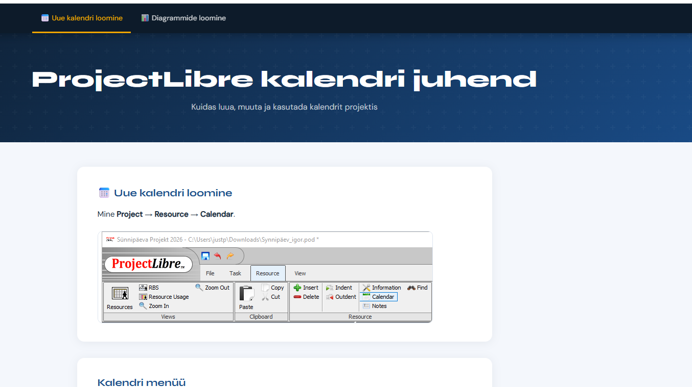
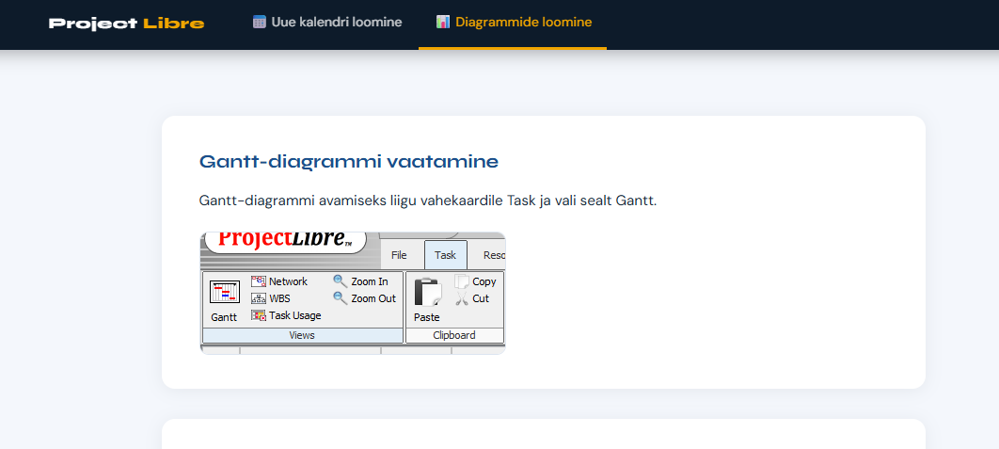

# 📊 KalenderProject – MS Project

> Professionaalne projektiplaneerimine ja haldus Microsoft Project tarkvara abil.

---

## 📋 Sisukord

- [Projekti ülevaade](#-projekti-ülevaade)
- [Projekti eesmärgid](#-projekti-eesmärgid)
- [Rakendatud funktsioonid](#-rakendatud-funktsioonid)
- [Projekti etapid](#-projekti-etapid)
- [Tehtu nimekiri](#-tehtu-nimekiri)
- [Koodinäide](#-koodinäide)
- [Ekraanipildid](#-ekraanipildid)

---

## 📖 Projekti ülevaade

See projekt keskendub MS Projecti võimekuse maksimaalsele rakendamisele. Erinevalt tavalisest tabelarvutusest võimaldab see dünaamilist planeerimist, kus üks muudatus ahelas korrigeerib automaatselt kogu projekti lõppkuupäeva.

Põhifookus on suunatud:
1. **WBS** – Hierarhiline ülesannete süsteem.
2. **Kriitiline tee** – Projekti riskipunktide tuvastamine.
3. **Ressursihaldus** – Tööjõu ja materjalide optimeerimine.

---

## ✨ Rakendatud funktsioonid

### 📅 Kalendrihaldus
- Kohandatud tööaja seadistamine (`Change Working Time`).
- Riigipühade ja ettevõtte erandite lisamine projektikalendrisse.

### 🔗 Dünaamilised seosed
- Nelja tüüpi seoste kasutamine: `FS`, `SS`, `FF`, `SF`.
- Automaatplaneerimise režiimi (`Auto Schedule`) rakendamine kõikidele ülesannetele.

### 📉 Analüütika
- **Baseline** – Algse plaani salvestamine võrdluseks.
- **Gantt Chart** – Visuaalne ülevaade ajakavast ja verstapostidest.

---

## 🧩 Projekti etapid

1. **Seadistamine** – Projekti alguspunkti ja parameetrite määramine.
2. **Struktureerimine** – Taanderea (`Indent`) abil faaside loomine.
3. **Sõltuvused** – Ülesannete vaheliste loogiliste seoste loomine.
4. **Baasplaan** – Projekti kinnitamine (`Set Baseline`).

---

## ✅ Tehtu nimekiri

- [x] Projekti üldinfo ja kalendri seadistamine
- [x] Ülesannete loendi ja WBS struktuuri loomine
- [x] Kestuste ja verstapostide (*Milestones*) määramine
- [x] Ülesannete vaheliste seoste ja viitajate lisamine
- [x] Ressursside lehe täitmine ja määramine
- [x] Kriitilise tee analüüs ja baasplaani salvestamine
- [x] Dokumentatsiooni koostamine `README.md` failina

---

## 📊 Failide tabel

| Fail | Kirjeldus | Funktsioon |
|------|-----------|------------|
| `Project.mpp` | MS Project fail | Peamine projektihaldusfail |
| `README.md` | Dokumentatsioon | Projekti kirjeldus ja etapid |
| `images/` | Ekraanipildid | Visuaalne tõestus tehtud tööst |

---
##Ekraani pildid



## 💻 Koodinäide

Näide sellest, kuidas MS Project käsitleb automaatset planeerimist ja seoseid (loogiline struktuur):

```xml
<Task>
  <Name>Vundamendi valamine</Name>
  <Duration>5d</Duration>
  <Predecessor>ID-1 (FS)</Predecessor>
  <IsCritical>True</IsCritical>
  <Calendar>Eesti_Töökalender</Calendar>
</Task>

